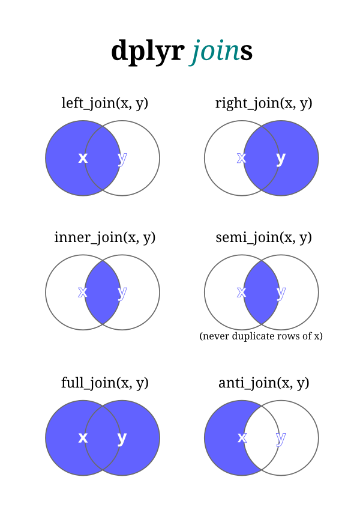

```{r setup, include=FALSE}
options(htmltools.dir.version = FALSE)
```


class: inverse, center, middle

# Olá!

Bruna Wundervald <br>
<a href="mailto:brunadaviesw@gmail.com"><i class="fa fa-paper-plane fa-fw"></i>&nbsp; brunadaviesw@gmail.com</a><br>
<a href="https://brunaw.github.io/"><i class="fa fa-link fa-fw"></i>&nbsp; brunaw.github.io</a><br>
<a href="http://github.com/brunaw"><i class="fa fa-github fa-fw"></i>&nbsp; @brunaw</a><br>
<i class="fa fa-map-marker fa-fw"></i>&nbsp; São Paulo, SP, Brasil</a>

<p>&nbsp;</p>

```{r, echo = FALSE, out.width="75%"}
knitr::include_graphics(c("img/logos.png"))
```

---

class: center


# O *tidyverse*

--- 

>  Coleção de pacotes para ciência de dados, que compartilham
a mesma filosofia, gramática e estruturas de dados. 

```{r, echo = FALSE, out.width="75%", fig.align='center'}
knitr::include_graphics("img/tidy_workflow.png")
```

---

class: left

# Pacotes

```{r, eval = FALSE}
library(tidyverse) 
tidyverse::tidyverse_packages()
```


  * `ggplot2`: gráficos bonitos
  * `dplyr`: manipulação de dados
  * `tidyr`: leitura de dados
  * `readr`: *tidy*zar os dados
  * `purrr`: programação funcional
  * `tibble`: *data.frames* simples
  * `magrittr`: semântica
  * `stringr`: lidar com *strings* (texto)
  * `forcats`: lidar com fatores (classes)
  * `lubridate`: lidar com datas (classes)


---

class: left

# Pacotes

```{r, eval = FALSE}
library(tidyverse) 
tidyverse::tidyverse_packages()
```


  * `ggplot2`: gráficos bonitos
  * **`dplyr`: manipulação de dados**
  * `tidyr`: leitura de dados
  * `readr`: *tidy*zar os dados
  * `purrr`: programação funcional
  * `tibble`: *data.frames* simples
  * **`magrittr`: semântica**
  * `stringr`: lidar com *strings* (texto)
  * `forcats`: lidar com fatores (classes)
  * `lubridate`: lidar com datas (classes)


---

class: left

# Livro


```{r, echo = FALSE, out.width="35%", fig.align='center', fig.cap="Livro: R for Data Science, Hadley Wickham & Garrett Grolemund"}
knitr::include_graphics("img/ds.png")
```


---

# O `magrittr` e o `pipe` 

  * O `pipe`, ou `%>%`, é um operador que aplica aos 
valores a sua esquerda operações que estão a direita. 

```{r, echo = TRUE, message = FALSE, warning = FALSE}
library(magrittr)

iris %>% 
  summary()
```


---

# O `magrittr` e o `pipe`

  * Podem ser encadeadas tantas operações quanto se 
  queira. 
  
  * Variáveis temporárias não são criadas. 

```{r}
iris %>%
  subset(Sepal.Length > mean(Sepal.Length)) %>% 
  summary()
```


---

# `%<>%`

* Operador de subscrição: `%<>%`

```{r}
iris$Sepal.Length %<>% sqrt()
```


```{r, echo = FALSE, out.width="25%", fig.align='center', fig.cap="Isto não é um cachimbo!"}

```

---
background-image: url("https://media.giphy.com/media/3o7btPCcdNniyf0ArS/giphy-downsized.gif")
background-position: 50% 80%

# O `dplyr`

  >  Gramática de manipulação de dados, construída
  através de "verbos".

  * `mutate()`: adicionar novas variáveis, que podem ser
  funções de outras. 
  * `select()`: seleciona ou descarta variáveis.
  * `filter()`: filtros por critérios. 
  * `summarise()`: resumir os dados. 
  * `arrange()`: ordenar os dados. 
  * `group_by()`: performar operações dentro de grupos.

---


# Exemplos

```{r, message = FALSE, warning = FALSE}
library(dplyr)

starwars %>% 
  head()
```

  * `tibbles`: data.frames modernos
---

# Exemplos

```{r, message = FALSE, warning = FALSE}
starwars %>% 
  select(hair_color, birth_year, name) %>% 
  head(4)

starwars %>% 
  select(-hair_color, -birth_year, -name) %>% 
  head(4)
```

---

# Exemplos

```{r, message = FALSE, warning = FALSE}
starwars %>% 
  na.omit() %>% 
  filter(eye_color == "yellow") %>% 
  mutate(imc = mass/(height^2)) %>% 
  select(name, gender, imc)
```

---

# Exemplos

```{r, message = FALSE, warning = FALSE}
starwars %>% 
  na.omit() %>% 
  dplyr::mutate(imc = mass/(height^2)) %>% 
  dplyr::group_by(species) %>%
  dplyr::summarise(
    qtde = n_distinct(name), 
    media_imc = mean(imc)
  ) %>% 
  dplyr::select(species, qtde, media_imc) %>% 
  dplyr::arrange(media_imc)
```


---

# Exemplos

  * E porque usar os `::`?
    * Os `::` acesssam funções diretamente do pacote. 
    * O `dplyr`, na verdade, é a nova versão do `plyr`, 
  focada em data.frames. 
    * Eles têm funções com o mesmo nome.

```{r, eval = FALSE}
plyr::summarise()
dplyr::summarise()
```

  * Como posso ver o que está em conflito no meu ambiente?
```{r}
conflicts() %>% head(10)
```
  
---

# Joins

  > Uniões de bases através de chaves. 
  
<p>&nbsp;</p>

  * `left_join()`: dados que estão na base "à esquerda".
  * `right_join()`: dados que estão na base "à direita".
  * `inner_join()`: dados que estão em ambas as bases.
  * `anti_join()`: linhas que estão apenas em uma base, 
  removendo a intersecção. 
  * `full_join()`: todas as linhas.

---

```{r, echo = FALSE, out.width="60%", fig.align='center'}

```

---

# Exemplo

```{r}
bd_1 <- starwars %>% 
  filter(height < 165) %>% 
  select(name, height)

bd_1 %>% head()
dim(bd_1)
```

---

# Exemplo

```{r}

bd_2 <- starwars %>% 
  filter(mass < 100) %>% 
  select(name, mass)

bd_2 %>% head()
dim(bd_2)
```

---

# Exemplo

```{r}
dplyr::left_join(bd_1, bd_2, by = "name")
```

---

# Exemplo


```{r}
dplyr::inner_join(bd_1, bd_2, by = "name")
```

---

# Exemplo


```{r}
dplyr::full_join(bd_1, bd_2, by = "name")
```

---

class: center, middle

```{r, echo = FALSE, out.width="35%", fig.align='center'}
knitr::include_graphics("img/dplyr.png")
```

---

class: center, middle

# Obrigada!